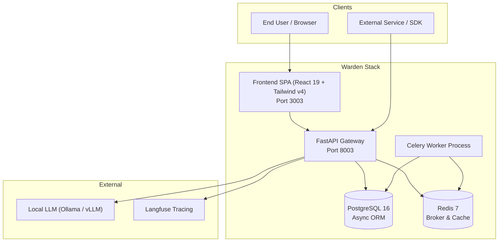

# System Architecture

## C4 Container Diagram

```mermaid
flowchart TD
    subgraph Clients
        WebUser["End User / Browser"]
        APIClient["External Service / SDK"]
    end

    subgraph Warden Stack
        Frontend["Frontend SPA (React 19 + Tailwind v4)\nPort 3003"]
        Gateway["FastAPI Gateway\nPort 8003"]
        Worker["Celery Worker Process"]
        DB[("PostgreSQL 16\nAsync ORM")]
        Redis[("Redis 7\nBroker & Cache")]
    end

    subgraph External
        Ollama["Local LLM (Ollama / vLLM)"]
        Langfuse["Langfuse Tracing"]
    end

    WebUser --> Frontend
    Frontend --> Gateway
    APIClient --> Gateway
    Gateway --> DB
    Gateway --> Redis
    Gateway --> Ollama
    Gateway --> Langfuse
    Worker --> Redis
    Worker --> DB
```
